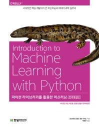
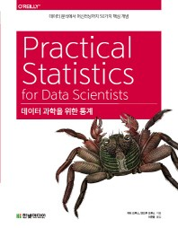
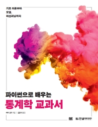

# 📈 Statistics & Machine Learning
- 책의 개념과 실습 코드를 통해 통계와 머신러닝 기초을 쌓았습니다.
- 배운 것들을 대회나 프로젝트에 적용함으로써, 활용 능력을 높이고 있습니다.

   
---
### 1. 파이썬 라이브러리를 활용한 머신러닝
- 머신러닝 개념과 예시를 보며 기초 이해를 쌓음
- 실습한 내용을 바탕으로 다른 대회나 프로젝트에 적용해봄으로써, 활용 능력을 높일 수 있었음   

### 2. 데이터 과학을 위한 통계
- 통계에 대한 전반적인 이해 기반과 머신러닝 활용법까지 많은 것을 배울 수 있었음       
📌 앞으로 실무 분석 업무를 할 때도 자주 참고할 책! 

### 3. 파이썬으로 배우는 통계학 교과서
- back to the basic! ✏
- 가볍고 어렵지 않은 내용으로 기술되어있어, 빠르게 읽으며 학습 중

