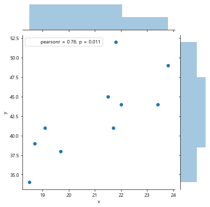
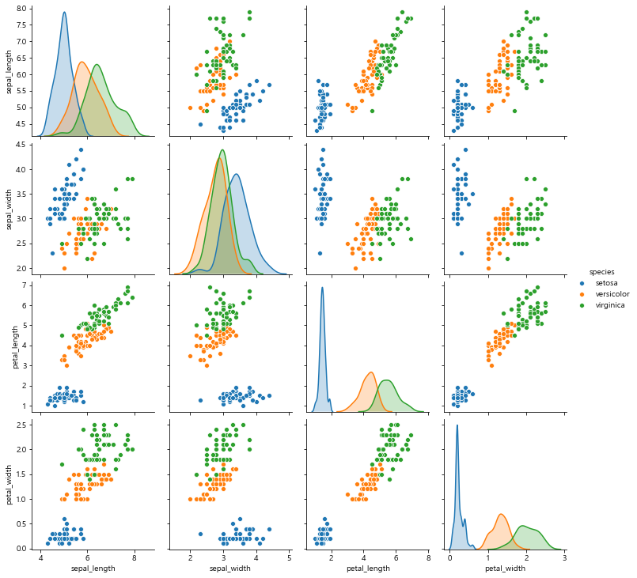

# 1. 기초통계학
```
- 수많은 데이터를 요약해서 이해하기 쉽게 만들고
- 보유한 데이터를 이용해 모르는 데이터를 추측할 수 있다는 것이 통계학을 배우는 가장 큰 이유!
```

## 1-1. 기술통계와 시각화(분포)
- 기술통계로 데이터를 요약해서 이해하기 쉽게 만듬
- 수치형: 이산형(int type), 연속형(float type의 연속적으로 변하는 수치)
- 범주형: 명목척도, 서열척도
- **통계량**
	1. 평균
		- 산술평균
		- 이상치의 영향을 크게 받음
	2. 기댓값
		- 얻지 못한 모르는 데이터에도 적용 가능한 평균값
		- '확률*값'의 합계
	3. 중앙값
		- 정렬된 상태에서 중간에 있는 수치
		- 이상치에 덜 민감함
	4. 분산
		- 데이터가 평균에서 얼마나 떨어져 있는지 나타내는 지표
		- 불편분산 사용
			- 분산을 N으로 나누는 표본분산의 경우, 모분산에 비해 분산을 과소평가하는 경향이 있음
			- N-1로 나눠줌으로써, 분산을 조금 더 크게해서 과소추정하는 경향 완하시켜줌       
			```python
				sp.var(data, ddof=1)   # ddof=1은 불편분산, 0은 표본분산
			```
	5. 표준편차
		- 데이터가 평균에서 얼마나 떨어져 있는지 나타내는 지표
		- 분산에 제곱근을 씌운 것
			- 분산은 편차 제곱을 통해 계산되기 때문에, 원래의 단위에서 제곱한 수치임
			- 제곱근을 씌워 원래 단위와 맞춰주는 것          
			```python
				sp.sqrt(variance)   # 분산 이미 구한 경우
				sp.std(data, ddof=1)
			```
- 표준화
	- 데이터의 평균을 0, 표준편차(분산)을 1로 변환하는 것
	- 데이터간 비교를 용이하게 함
- 공분산과 피어슨 상관계수
	- 두 연속형 변수 간의 관계성 확인하는 지표
	- 공분산은 값의 최대/최소가 얼마가 될지 알 수 없음 → 일정한 범위를 갖는 피어슨 상관계수 사용!
	1. 공분산
		1. Cov(X, Y) >= 0 : x가 평균보다 클 때, y도 평균보다 큰 값을 갖는다고 기대
		2. Cov(X, Y) < 0 : x가 평균보다 클 때, y도 평균보다 작은 값을 갖는다고 기대 
		3. Cov(X, Y) = 0 : 두 변수 사이에 관계성이 없음
	2. 피어슨 상관계수
		- 공분산을 -1 ~ +1 사이 범위가 되도록 표준화한 것
- 시각화를 통한 데이터 분포 확인
	1. 히스토그램
		- 도수분포를 도표로 나타낸 것이 히스토그램
		- 가로축-계급, 세로축-도수
		- 실제로는 커널밀도추정에 따른 히스토그램 평활화를 이용해 시각화함(구간 수 지정 X)
			- 구간 수 잘못 지정 시 데이터의 특징이 전혀 드러나지 않을 수도 있기때문에          
			```python
				sns.distplot(data)   # kde=True 커널밀도추청이 기본값
			```
	2. Box plot
		- '카테고리 변수 X 수치형 변수' 조합의 데이터를 표시하는 경우 많이 사용
		- 중심선은 중앙값
		- 윗단, 아랫단은 75%(Q3), 25%(Q1) 사분위점
		- 수염은 데이터의 범위를 나타내며, 벗어난 값은 이상치로 판단함 
			- IQR= Q3 - Q1
			- 박스플롯의 이상치 판단 기준 = IQR*1.5
	3. Violin plot
		- '카테고리 변수 X 수치형 변수' 조합의 데이터를 표시하는 경우 많이 사용
		- 박스플롯의 박스 대신 커널밀도추정의 결과를 사용해 시각화해줌 → 데이터 집중된 부분 파악 가능
	4. 산포도(Scatter plot)
		- '수치형 변수 X 수치형 변수' 조합 시각화
		- 산포도와 함께 히스토그램도 같이 시각화 가능
			```python
				sns.jointplot(data=data, x='x', y='y')
			```	
		- 
	5. Pair plot
		- 다수의 변수를 가지고 있는 데이터에서 활용하는 방법 
			```python
				sns.pairplot(iris, hue='species')   # hue - 카테고리별로 색을 다르게
			```
		- 

→ ** 통계량(평균, 분산 등)과 시각화(히스토그램 등)를 통해 데이터의 형태/특징을 파악할 수 있음**

## 1-2. 확률질량함수와 확률밀도함수
- 확률(밀도)은 0 ~ 1 사이 값을 지님
- 확률질량함수
	- 이산형 변수의 값에 대응하는 확률
		- 이산형 변수는 특정 수치가 나타날 확률을 직접 계산 및 합계 가능
- 확률밀도함수
	- 연속형 변수의 값에 대응하는 확률
		- 연속형 변수는 범위를 통해 확률을 계산하며, 적분 사용
- 정규분포
	- -∞~∞사이의 실수값을 가짐
	- 확률밀도의 크기는 평균을 중심으로 좌우대칭
	- 평균=중앙값=최빈값
	- 평균값 부근의 확률밀도가 가장 큼
- 이항분포
	- 결과가 두 가지 패턴으로만 발생하는 데이터
	- 수량, 횟수 등 0 이상의 정수만 발생하는 데이터에 사용

## 1-3. 모집단 분포 추정 (추측통계)
- 모집단분포의 추정
	- **예측 대상의 분포 형태를 어느정도 미리 가정하지 않으면, 분석하기 어렵거나 현실과 동떨어진 분석 결과가 나올 수도 있으니 주의!**
	- 모수: 모집단의 특징을 나타내는 수치 (확률분포를 특징짓는 값)
		- 정규분포의 모수는 평균(기댓값), 분산
	- **'가정'**을 통해 후보를 좁히고 계산을 단순화 할 수 있음
		- 모집단분포 가정 시 **'정규분포'**가 자주 사용됨 
			- 계산 단순화, 데이터와 잘 대응 ↔ 현실의 분포와 맞지 않을 수 있음
		- 표본의 분포가 긴꼬리분포 형태일 경우, 정규분포 특성과 맞지 않아 추정이 어려움 
			- 다른 확률분포(이항분포, 푸아송분포 등) 사용
	- 표본의 통계량으로 모수와 모집단분포 추정
	- **추정오차** 고려!
		- 표본의 통계량과 모수에는 조금의 차이가 있는 것이 일반적
		- 추정된 모수에는 추정오차가 있음을 인정해야
		- 추정오차를 고려한 모수 추정 시 '구간추정' 등의 방법을 사용함


