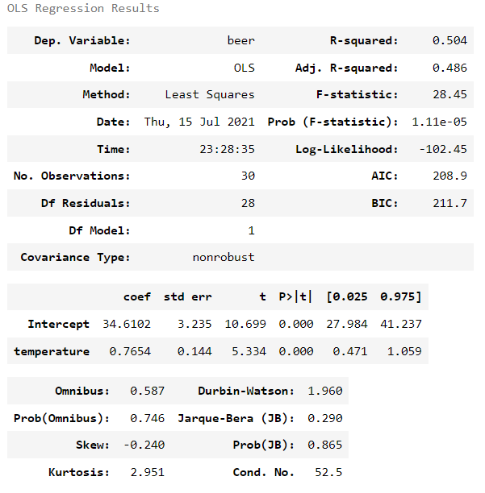

# 5. 정규선형모델

## 5-1. 단순회귀
- 연속형 독립변수가 1개만 있는 모델
- 파라미터 추정으로 식에 있는 계수 추정
	- 계수의 부호를 알면 독립변수가 종속변수에 미치는 영향의 방향(+,-)과 정도를 알 수 있음  
- 구현
	```python
	import statsmodels.formula.api as smf
	lm_model = smf.ols(formula='beer ~ temperature', data=beer).fit()   # formula로 모델의 구조 지정(종속변수-beer, 독립변수-temperature)
	lm_model.summary()   # 추정결과 표시
	```
- 추정결과 해석
	
	- 결정계수(R-squared)
		- 모델의 적합도 평가한 지표
		- 종속변수의 변동 크기 중 설명 가능한 변동폭의 비율(모델의 설명력)
			- 모델의 추측치가 종속변수의 실제값과 일치하면 R^2은 1이됨
	- 수정된 결정계수(Adj. R-squared)
		- 독립변수 수가 늘어나면 모델의 결정계수는 높아질 수 밖에 없음
		- 독립변수 수가 늘어나는 것에 대해 패널티를 적용한 결정계수
	- 독립변수가 종속변수에 주는 영향의 유의미 판단
		- temperature의 p값은 유의수준 0.05보다 작으므로, temperature에 대한 계수(coef)는 유의미하게 0과 다르다고할 수 있음
		- 기온이 맥주 매상에 영향을 미침
	- 독립변수의 계수
		- 계수값이 0.7654로 양수이므로, 기온이 오르면 매주 매상이 오른다고 판단할 수 있음

	- AIC
		- 다른 조합의 독립변수를 가진 모델과 성능 비교할 수 있음
- 회귀 직선
	- 모델에 의한 종속변수의 추측값을 직선으로 표시한 것
	- 음영 부분은 회귀직선의 95% 신뢰구간을 나타냄
	```python
	sns.lmplot(x='temperature', y='beer', data=beer)
	```
	

- 잔차 체크
	- 정규선형모델의 경우 잔차가 '평균이 0인 정규분포'를 따르므로, 모델이 그 분포를 따르고 있는지 체크
	- Q-Q plot
		- 이론상의 분위점과 실제 데이터의 분위점을 산포도 그래프로 그린 것
		- 잔차가 정규분포에 근접하는지 아닌지 시각적으로 판단 가능
			- 잔차가 정규분포를 따르면 직선 선상에 위치한다는 기준에 데이터가 근접해있는지 보면됨!
			- 가로축이 이론상의 분위점, 세로축이 정렬된 잔차 데이터 
		```python
		fig = sm.qqplot(lm_model.resid, line='s')
		```
		
	- Prob(Omnibus), Prob(JB) 확인
		- 잔차의 정규성에 대한 검정 결과를 나타내는 p-value
		- p-value가 0.05보다 큰지 확인
			- 0.05보다 작으면, 잔차가 정규분포와 다르다는 것
	- Durbin-Watson
		- 잔차의 자기상관을 체크하는 지표
		- 수치가 2 전후면 문제가 없다고 판단할 수 있음
			- 시계열 데이터를 분석하는 경우, 반드시 체크해야함
			- 잔차에 자기상관이 있으면 계수의 t-검정 결과를 신뢰할 수 없게됨
			
			