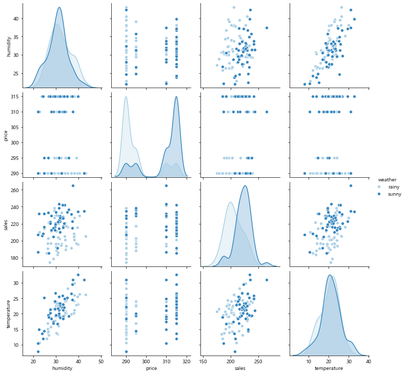

# 5. 정규선형모델

## 5-1. 단순회귀분석
- 연속형 독립변수가 1개만 있는 모델
- 파라미터 추정으로 식에 있는 계수 추정
	- 계수의 부호를 알면 독립변수가 종속변수에 미치는 영향의 방향(+,-)과 정도를 알 수 있음  
- 구현
	```python
	import statsmodels.formula.api as smf
	# formula로 모델의 구조 지정(종속변수-beer, 독립변수-temperature)
	lm_model = smf.ols(formula='beer ~ temperature', data=beer).fit()
	lm_model.summary()   # 추정결과 표시
	```

- 추정결과 해석

	       
	
	- 결정계수(R-squared)
		- 모델의 적합도 평가한 지표
		- 종속변수의 변동 크기 중 설명 가능한 변동폭의 비율(모델의 설명력)
			- 모델의 추측치가 종속변수의 실제값과 일치하면 R^2은 1이됨
	- 수정된 결정계수(Adj. R-squared)
		- 독립변수 수가 늘어나면 모델의 결정계수는 높아질 수 밖에 없음
		- 독립변수 수가 늘어나는 것에 대해 패널티를 적용한 결정계수
	- 독립변수가 종속변수에 주는 영향의 유의미 판단
		- temperature의 p값은 유의수준 0.05보다 작으므로, temperature에 대한 계수(coef)는 유의미하게 0과 다르다고할 수 있음
		- 기온이 맥주 매상에 영향을 미침
	- 독립변수의 계수
		- 계수값이 0.7654로 양수이므로, 기온이 오르면 매주 매상이 오른다고 판단할 수 있음

	- AIC
		- 다른 조합의 독립변수를 가진 모델과 성능 비교할 수 있음
- 회귀 직선
	- 모델에 의한 종속변수의 추측값을 직선으로 표시한 것
	- 음영 부분은 회귀직선의 95% 신뢰구간을 나타냄
	```python
	sns.lmplot(x='temperature', y='beer', data=beer)
	```
	

- 잔차 체크
	- 정규선형모델의 경우 잔차가 '평균이 0인 정규분포'를 따르므로, 모델이 그 분포를 따르고 있는지 체크
	- Q-Q plot
		- 이론상의 분위점과 실제 데이터의 분위점을 산포도 그래프로 그린 것
		- 잔차가 정규분포에 근접하는지 아닌지 시각적으로 판단 가능
			- 잔차가 정규분포를 따르면 직선 선상에 위치한다는 기준에 데이터가 근접해있는지 보면됨!
			- 가로축이 이론상의 분위점, 세로축이 정렬된 잔차 데이터 
		```python
		fig = sm.qqplot(lm_model.resid, line='s')
		```
		
	- Prob(Omnibus), Prob(JB) 확인
		- 잔차의 정규성에 대한 검정 결과를 나타내는 p-value
		- p-value가 0.05보다 큰지 확인
			- 0.05보다 작으면, 잔차가 정규분포와 다르다는 것
	- Durbin-Watson
		- 잔차의 자기상관을 체크하는 지표
		- 수치가 2 전후면 문제가 없다고 판단할 수 있음
			- 시계열 데이터를 분석하는 경우, 반드시 체크해야함
			- 잔차에 자기상관이 있으면 계수의 t-검정 결과를 신뢰할 수 없게됨

## 5-2. 분산분석(ANOVA)
- 3개이상 수준 간의 평균값의 차이를 검정하는 방법
	- t검정은 2개 수준 간의 평균값 차이 검정만 가능
	- 분산의 비율을 취한 통계량으로 검정을 시행함
- F비(F-statistic)
	- F비가 크면 오차에 비해 효과의 영향이 클 것이라고 판단할 수 있음
	- F비 = 효과의 분산 크기 / 오차의 분산 크기
		-  효과의 분산 크기
			- 독립변수에 따른 종속변수의 변동 
			- violinplot 간의 거리
		- 오차의 분산 크기
			- 독립변수로 설명할 수 없는 종속변수의 변동
			- 각 violinplot의 폭
	- F분포를 통해 p-value 계산 후 유의미 차이 판단
- 유의미한 차이가 있을 때와 없을 때의 violinplot
	- 그래프로만 판단해서는 안되며, 분산분석을 통한 정량적인 기준을 이용해 판단해야 함!
	1. 유의미한 차이가 있을 것 같은 예시
		
	2. 유의미한 차이가 없을 것 같은 예시
		
- 분산분석을 통한 변수 선택 및 모델 예시
	- 종속변수: 매상 
	- 독립변수: 습도, 기온, 날씨(맑은 or 비), 가격
	- 변수 간의 관계 시각화
		- 기온이 높아지면 습도도 높아지는 관계가 있는 것 같음
		- 비오는 날 매출이 낮은 경향이 있는 것 같음
		

	1. 모든 독립변수가 포함된 모델
		```python
		model_full = smf.ols('sales ~ weather + humidity + temperature + price', sales).fit()
		sm.stats.anova_lm(model_full, typ=2).round(3)
		```
		
		- 습도의 p-value가 0.578 → 습도는 매상에 유의미한 영향을 끼지고 있다고 볼 수 없음
			- 기온과 습도의 상관관계가 있었던 것이 이유가 된 것 같음
	2. 독립변수 중 습도를 제거한 모델
		```python
		model_non_humi = smf.ols('sales ~ weather + humidity + temperature + price', sales).fit()
		sm.stats.anova_lm(model_non_humi, typ=2).round(3)
		```
				
		- 유의하지 않은 변수가 없음 → 변수 선택 종료
		
- AIC를 이용한 변수 선택
	```python
	model_full.aic.round(3)    # 808.785
	model_non_humil.aic.round(3)  # 807.112
	```
	- 습도를 제외한 모델이 AIC 점수가 더 낮으므로, 습도 변수 제외해야
	- 분산분석을 통해 얻은 결과와 동일한 결론이 나옴
	- AIC는 검정의 다중성을 걱정할 필요가 없으며, 검정의 비대칭성 문제도 없음
	
## 5-3. 검정과 모델링 관련 주의점
- 검정의 다중성
	- 검정을 반복함으로써 유의미한 결과를 얻기 쉬워지는 문제
	- ex. 날씨의 맑음, 흐림, 비 3가지 수준을 3가지 조합(맑음vs비, 맑음vs흐림, 비vs흐림)으로 t검정 실시한 경우 검정의 다중성 문제 발생
		→ 이 경우 분산분석 사용해서 날씨에 따라 매상이 다른지 한 번의 검정으로 판단해야 함
- 다중공산성
	- 독립변수 간에 강한 상관관계가 있을 때 나타나는 문제
		- 계수와 p-value에 대한 해석이 어려워짐
	- 강한 상관관계가 있는 변수 중 모델에 중요도가 상대적으로 낮은 한쪽의 변수를 제거하고 모델링 해야 함
	- 리지 회귀 등을 이용함으로써 문제 완화할 수도 있음	