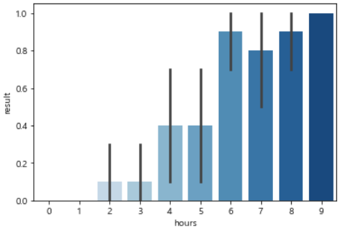
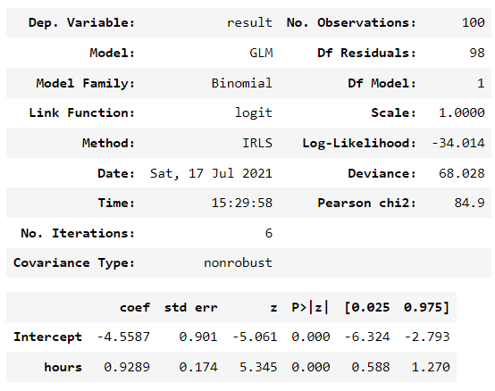
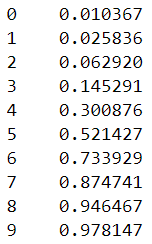
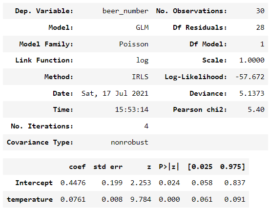

# 6. 일반선형모델
- 정규분포 이외의 확률분포를 사용할 수 있다는 것이 특징

## 6-1. 정규분포 이외의 확률분포
1. 베르누이 분포
	- **한 번**의 베르누이 시행이 일어날 때 이항확률변수가 따르는 확률분포
		- 베르누이 시행: 2종류의 결과 중 하나만 발생시키는 시행
		- 이항확률변수: 2개의 값만 가지는 확률변수
2. 이항분포
	- 성공확률이 p이면서 **n회**의 독립 베르누이 시행을 했을 때 성공한 횟수 m을 따르는 이산형 확률분포
	- 실제 분석에 사용 시 '성공확률 p가 어떻게 변화하는가'라는 시점으로 이항분포 사용되는 경우 다수
		- ex. 가격을 변경하면 상품의 '구입률'이 변화하는지, 공부시간을 바꾸면 시험의 '합격률'이 변화하는지 등
	- 정규분포와 달리 좌우비대칭인 형태를 띔
3. 푸아송 분포
	- count data가 따르는 이산형 확률분포
		- 0 이상의 정수를 가지는 것이 특징
	- ex. 날씨에 따라 상품의 판매 '개수'가 얼마나 달라지는지, 주변 환경에 따라 조사 구획내의 생물 '개체수'가 변하는지 등
	- 푸아송 분포는 이항분포에서 도출할 수 있음
		- 성공확률이 한없이 0에 가깝지만, 시행횟수가 무한히 많은 이항분포
4. 음이항분포
	- 푸아송 분포와 마찬가지로 count data가 따르는 확률분포
	- 푸아송 분포보다 분산이 큰 것이 특징
5. 감마분포
	- 0 이상의 값을 취하는 연속형 확률변수가 따르는 확률분포 

## 6-2. 일반선형모델
- 일반선형모델을 이용하면 분류 문제와 회귀 문제를 통일성 있게 취급할 수 있음
- 파라미터 추정
	- 정규분포 이외의 확률분포가 사용되는 경우도 있기 때문에 최대우도법에 의한 파라미터 추정 수행
	- 파라미터 추정을 위한 알고리즘으로 반복적인 최소제곱법(IRLS)이 이용되는 경우 다수
- 계수 검정 방법
	- t-검정을 실시할 수 없으며, 대신 Wald검정 사용
		- Wald 검정: 샘플사이즈가 클 때 추정값이 정규분포를 따르는 것을 이용한 검정 방법
	- 분산분석과 같은 해석을 할 수 있는 우도비 검정도 사용됨
		- 우도비 검정: 모델의 적합도를 비교하는 방법
- 모델 적합도 평가
	- 잔차는 데이터와 모델의 괴리를 나타내는 주요 지표이므로, 잔차 체크 필수
	1. 피어슨 잔차(Pearson chi2)
		- 모델 적합도 지표이며, 일반 잔차를 분포의 표준편차로 나눈 것
		- 모델이 잘 적합되지 않은 경우 큰 Pearson 잔차를 가짐
	2. Deviance 
		- 모델의 적합도를 평가하는 지표
		- deviance가 크면 데이터에 모델이 맞지 않는다고 평가할 수 있음
		- deviance 최소로하는 것은 = 교차 엔트로피 오차를 최소로하는 것과 같음
- 종류
	1. 로지스틱 회귀
		- 이항분포와 로짓함수를 사용한 일반선형모델
		- 독립변수는 여러 개 있어도 상관 없으며, 연속형과 카테고리형이 섞여 있어도 상관없음
		- ex. 공부시간에 따른 시험 합격/불합격 예측
			- 종속변수: 합격=1, 불합격=0
			- 독립변수: 공부시간
			- 공부시간과 합격률의 관계 그래프
				- 공부시간이 길어지면 합격률이 높아지는 것 처럼 보임
				
			- 로지스틱 회귀
				- 공부시간의 계수는 양수이며, p-value가 유의수준 5% 미만이므로 유의함      
				 → 공부시간이 늘어날 수록 합격률이 높아지는 경향이 있음
				```python
				mod_glm = smf.glm(formula='result ~ hours', 
                					data=test_result, 
                 					family=sm.families.Binomial()   # 이항분포 지정
            						).fit()
				mod_glm.summary()
				```
				
			- 합격 확률 예측
				- 9시간 공부 시 98%가까이 합격률이 올라감
				- 합격/불합격 여부로 예측 결과를 도출하고 싶을 때는 반올림하여 0.5를 넘으면 합격 처리
				```python
				exp_val = pd.DataFrame({'hours':np.arange(0,10,1)})
				pred=mod_glm.predict(exp_val)
				pred
				```
				
	2. 푸아송 회귀
		- 푸아송분포와 로그함수를 사용한 일반선형모델
		- 독립변수는 여러 개 있어도 상관없으며, 연속형과 카테고리형이 혼재되어 있어도 상관없음
		- ex. 기온에 따른 맥주 판개 개수 예측
			- 기온의 계수는 양수이며, p-value가 유의수준 5% 미만이므로 유의함       
				→ 기온이 오르면 판매 개수도 늘어난다고 할 수 있음
			```python
			mod_pois = smf.glm(formula='beer_number ~ temperature', 
                  				data=beer, 
                  				family=sm.families.Poisson()   # 푸아송 분포 지정
                				).fit()
			mod_pois.summary()
				```
			

			- 기온이 1도 오르면 맥주 판매 개수가 약 0.079**배** 늘어난다고 할 수 있음
				- 로그함수를 사용한 모델이므로 독립변수의 영향이 덧셈에서 곱셈이 됨 → 계수 해석 주의!!
			```python
			np.exp(mod_pois.params['temperature'])   # 1.0790450...
			```
		 
			
			
